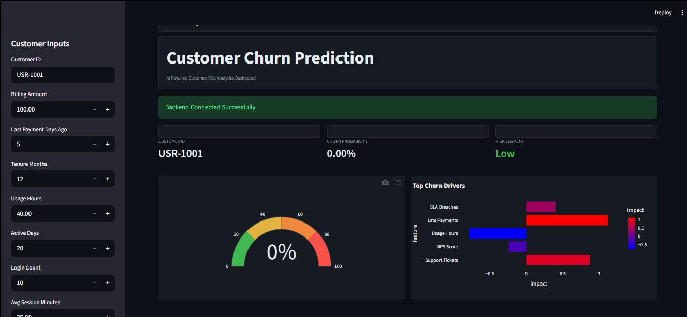
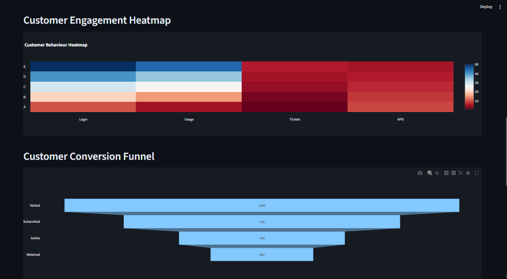
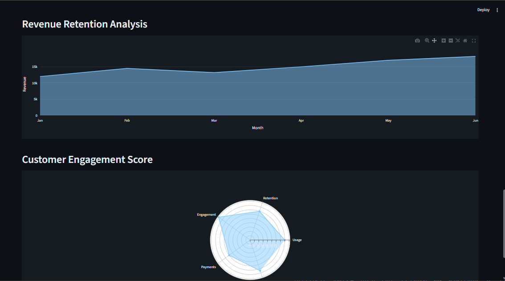
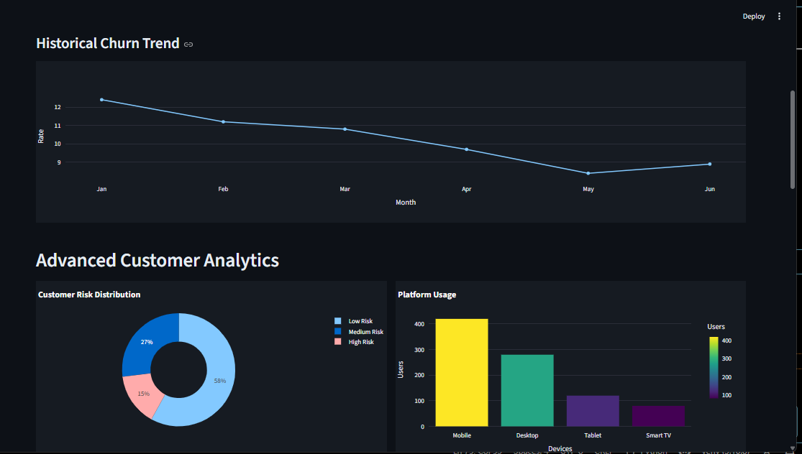

# Customer Churn Prediction Model

##  Overview

This project aims to predict whether a customer will churn (leave a service) based on their usage patterns and account information. It uses machine learning techniques to analyze customer behavior and provide insights that can help businesses reduce churn.

## Objectives

* Analyze customer data using Exploratory Data Analysis (EDA)
* Build a machine learning model to predict churn
* Perform feature engineering to improve model performance
* Visualize patterns and relationships in the data
* Save outputs and prepare for deployment

## Project Structure

Customer-Churn-Prediction-Model/
│
├── data/
│   └── churn.csv
│
├── notebooks/
│   ├── EDA.ipynb
│   ├── feature_engineering.ipynb
│ 
│
├── dashboard/
├── data/
│ └── churn.csv
│
├── images/
│ ├── customer_engagement_and_conversion_funnel.png
│ ├── dashboard_analytics_view.png
│ ├── dashboard_overview.png
│ └── revenue_retention_engagement_dashboard.png
│
Customer-Churn-Prediction-Model/
│
├── data/
│   └── churn.csv
│
├── notebooks/
│   ├── EDA.ipynb
│   ├── feature_engineering.ipynb
│   └── churn_model_training.ipynb
│ 
│ 
├── images/
│ ├── customer_engagement_and_conversion_funnel.png
│ ├── dashboard_analytics_view.png
│ ├── dashboard_overview.png
│ └── revenue_retention_engagement_dashboard.png
│ 
│ 
├── outputs/
│   ├── churn_distribution.png
│   ├── tenure_vs_churn.png
│   ├── monthly_vs_churn.png
│   ├── total_vs_churn.png
│   └── correlation.png
│
├── src/
│   ├── preprocessing.py
│   ├── train_model.py
│   └── predict.py
│
├── models/
│   └── churn_model.pkl
│
├── main.py
├── requirements.txt
└── README.md

## Dataset Features

* `tenure` – Number of months the customer has stayed
* `MonthlyCharges` – Monthly subscription cost
* `TotalCharges` – Total amount spent
* `Churn` – Target variable (0 = No, 1 = Yes)

##  Exploratory Data Analysis (EDA)

The project includes visualizations such as:

* Churn distribution
* Tenure vs Churn
* Monthly Charges vs Churn
* Total Charges vs Churn
* Correlation heatmap

All charts are saved in the `outputs/` folder.

##  Feature Engineering

* Converted `TotalCharges` to numeric
* Handled missing values
* Created new feature: `AvgCharges`
* Created categorical feature: `TenureGroup`
* Applied one-hot encoding
* Scaled features using `StandardScaler`

## Model Used

* Logistic Regression

###  Model Performance

* Accuracy: ~ (update with your result)

## Installation

1. Clone the repository:

git clone https://github.com/Nikhatjahan85/customer-churn-prediction.git
cd customer-churn-prediction

2. Create virtual environment:

python -m venv venv
venv\Scripts\activate   # Windows

3. Install dependencies:

pip install -r requirements.txt

## How to Run

### Run EDA:

jupyter notebook notebooks/EDA.ipynb

### Train Model:

python src/train_model.py

### Run Prediction

python src/predict.py

### Run API

uvicorn api.app:app --reload --port 8011

### Run Dashboard (Streamlit)

streamlit run dashboard/app.py

## Interactive Dashboard

An interactive dashboard is included to visualize customer churn insights and make predictions in real-time.

### Features

- Churn distribution visualization  
- Feature-wise analysis (tenure, charges)  
- Correlation heatmap  
- Real-time churn prediction input form  

##  Dashboard Preview

### 🔹 Overview

### 🔹 Customer Engagement & Conversion Funnel

### 🔹 Revenue Retention & Engagement

### 🔹 Analytics View

## Dependencies

* pandas
* numpy
* matplotlib
* seaborn
* scikit-learn

## 🔮 Future Improvements

* Use advanced models (Random Forest, XGBoost)
* Hyperparameter tuning
* Build REST API using FastAPI
* Create dashboard using Streamlit
* Deploy on cloud

## Conclusion

This project demonstrates how machine learning can be applied to predict customer churn and help businesses take proactive measures to retain customers.

##  Author

Nikhat Jahan

GitHub: https://github.com/Nikhatjahan85
⁠
